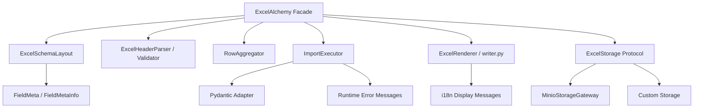
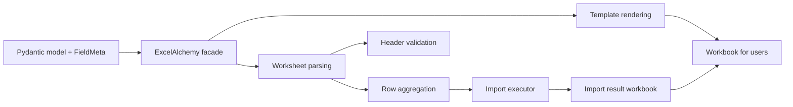

# ExcelAlchemy

[](https://github.com/RayCarterLab/ExcelAlchemy/actions/workflows/ci.yml)
[](https://app.codecov.io/gh/RayCarterLab/ExcelAlchemy)


[中文 README](https://github.com/RayCarterLab/ExcelAlchemy/blob/main/README_cn.md) · [About](https://github.com/RayCarterLab/ExcelAlchemy/blob/main/ABOUT.md) · [Getting Started](https://github.com/RayCarterLab/ExcelAlchemy/blob/main/docs/getting-started.md) · [Integration Roadmap](https://github.com/RayCarterLab/ExcelAlchemy/blob/main/docs/integration-roadmap.md) · [Result Objects](https://github.com/RayCarterLab/ExcelAlchemy/blob/main/docs/result-objects.md) · [API Response Cookbook](https://github.com/RayCarterLab/ExcelAlchemy/blob/main/docs/api-response-cookbook.md) · [Architecture](https://github.com/RayCarterLab/ExcelAlchemy/blob/main/docs/architecture.md) · [Examples Showcase](https://github.com/RayCarterLab/ExcelAlchemy/blob/main/docs/examples-showcase.md) · [Public API](https://github.com/RayCarterLab/ExcelAlchemy/blob/main/docs/public-api.md) · [Locale Policy](https://github.com/RayCarterLab/ExcelAlchemy/blob/main/docs/locale.md) · [Changelog](https://github.com/RayCarterLab/ExcelAlchemy/blob/main/CHANGELOG.md) · [Migration Notes](https://github.com/RayCarterLab/ExcelAlchemy/blob/main/MIGRATIONS.md)

ExcelAlchemy is a schema-driven Python library for Excel import and export workflows.
It turns Pydantic models into typed workbook contracts: generate templates, validate uploads, map failures back to rows
and cells, and produce locale-aware result workbooks.

This repository is also a design artifact.
It documents a series of deliberate engineering choices: `src/` layout, Pydantic v2 migration, pandas removal,
pluggable storage, `uv`-based workflows, and locale-aware workbook output.

The current stable release is `2.2.8`, which continues the ExcelAlchemy 2.x line with a clearer integration roadmap, stronger import-failure payload smoke verification, and more direct install-time validation of the FastAPI reference app.

## At a Glance

- Build Excel templates directly from typed Pydantic schemas
- Validate uploaded workbooks and write failures back to rows and cells
- Keep storage pluggable through `ExcelStorage`
- Render workbook-facing text in `zh-CN` or `en`
- Stay lightweight at runtime with `openpyxl` instead of pandas
- Protect behavior with contract tests, `ruff`, and `pyright`

## Screenshots

| Template | Import Result |
| --- | --- |
|  |  |

## Minimal Example

```python
from pydantic import BaseModel

from excelalchemy import ExcelAlchemy, FieldMeta, ImporterConfig, Number, String


class Importer(BaseModel):
    age: Number = FieldMeta(label='Age', order=1)
    name: String = FieldMeta(label='Name', order=2)


alchemy = ExcelAlchemy(ImporterConfig(Importer, locale='en'))
template = alchemy.download_template_artifact(filename='people-template.xlsx')

excel_bytes = template.as_bytes()
template_data_url = template.as_data_url()  # compatibility path for older browser integrations
```

## Modern Annotated Example

```python
from typing import Annotated

from pydantic import BaseModel, Field

from excelalchemy import Email, ExcelAlchemy, ExcelMeta, ImporterConfig


class Importer(BaseModel):
    email: Annotated[
        Email,
        Field(min_length=10),
        ExcelMeta(label='Email', order=1, hint='Use your work email'),
    ]


alchemy = ExcelAlchemy(ImporterConfig(Importer, locale='en'))
template = alchemy.download_template_artifact(filename='people-template.xlsx')
```

For browser downloads, prefer `template.as_bytes()` with a `Blob`, or return the bytes from your backend with
`Content-Disposition: attachment`. A top-level navigation to a long `data:` URL is less reliable in modern browsers.

## When To Use / When Not To Use / Limitations & Gotchas

### When To Use

- You want schema-driven Excel templates and imports in a Python backend.
- You want row-level and cell-level validation feedback tied to workbook coordinates.
- You want server-side workbook generation and processing without requiring Microsoft Excel on the host.
- You want a typed integration path built around Pydantic models and explicit storage boundaries.

### When Not To Use

- You need desktop Excel automation, live recalculation, or macro execution.
- You need a general spreadsheet analysis tool or a pandas-first data processing workflow.
- You need byte-for-byte preservation of an existing workbook as it moves through your system.
- You need UI-grade responsiveness for very large operational workbooks instead of batch-style backend processing.

### Limitations & Gotchas

- Formula cells are read through `openpyxl` using stored workbook values. ExcelAlchemy does not run Excel and does not recalculate formulas on the server.
- This is a server-side file-processing library, not a wrapper around a locally installed Excel application.
- Large workbook performance depends on workbook size, formula density, and validation workload. Treat large imports as backend jobs, not instant spreadsheet interactions.
- Exported or result workbooks should not be described as full-fidelity round trips of the original file. The library reads and renders the workbook data it needs for its own workflow.

| Scenario | Is ExcelAlchemy a good fit? |
| --- | --- |
| Backend upload validation and result workbook generation | Yes |
| Typed template generation from Pydantic models | Yes |
| Server-side processing in containers or Linux services | Yes |
| Desktop Excel automation or local Office integration | No |
| Exact workbook round-trip preservation for complex existing files | Usually no |

For concrete details and FAQ-style guidance, see
[`docs/limitations.md`](https://github.com/RayCarterLab/ExcelAlchemy/blob/main/docs/limitations.md).

## Repository Scope

- A library for building Excel workflows from typed schemas.
- A reference implementation of “facade outside, focused components inside”.
- A portfolio project that emphasizes architecture, migration strategy, and maintainability.

## Non-Goals

- Not a general spreadsheet analysis library.
- Not a pandas-first data wrangling tool.
- Not a GUI spreadsheet editor.
- Not a fully generic forms framework.

## Why This Exists

Many internal systems still receive business data through Excel.
The painful part is rarely “reading a file”; it is keeping templates, validation rules, row-level error reporting, and backend integration consistent across projects.

ExcelAlchemy treats Excel as a typed contract:

- the model defines the shape
- field metadata defines the workbook experience
- import execution is separated from parsing
- storage is an interchangeable strategy, not a hard-coded implementation

## Architecture

ExcelAlchemy exposes a small public surface and delegates the real work to internal components.



See the full breakdown in [docs/architecture.md](https://github.com/RayCarterLab/ExcelAlchemy/blob/main/docs/architecture.md).

## Workflow



## Design Principles

This repository is guided by explicit design principles rather than accidental convenience.
The full mapping is in [ABOUT.md](https://github.com/RayCarterLab/ExcelAlchemy/blob/main/ABOUT.md); the short version is:

1. Schema first.
2. Explicit metadata over implicit conventions.
3. Composition over monoliths.
4. Adapters at integration boundaries.
5. Protocols over concrete backends.
6. Progressive modernization over one-shot rewrites.
7. Runtime simplicity over hidden magic.
8. User-facing clarity over clever internals.
9. Tests should protect behavior, not implementation accidents.
10. Migration-friendly seams are part of the design.

## Quick Start

### Install

```bash
pip install ExcelAlchemy
```

If you want the built-in Minio backend:

```bash
pip install "ExcelAlchemy[minio]"
```

## Examples

Practical examples live in the repository:

- [`examples/annotated_schema.py`](https://github.com/RayCarterLab/ExcelAlchemy/blob/main/examples/annotated_schema.py)
- [`examples/employee_import_workflow.py`](https://github.com/RayCarterLab/ExcelAlchemy/blob/main/examples/employee_import_workflow.py)
- [`examples/create_or_update_import.py`](https://github.com/RayCarterLab/ExcelAlchemy/blob/main/examples/create_or_update_import.py)
- [`examples/date_and_range_fields.py`](https://github.com/RayCarterLab/ExcelAlchemy/blob/main/examples/date_and_range_fields.py)
- [`examples/selection_fields.py`](https://github.com/RayCarterLab/ExcelAlchemy/blob/main/examples/selection_fields.py)
- [`examples/custom_storage.py`](https://github.com/RayCarterLab/ExcelAlchemy/blob/main/examples/custom_storage.py)
- [`examples/export_workflow.py`](https://github.com/RayCarterLab/ExcelAlchemy/blob/main/examples/export_workflow.py)
- [`examples/minio_storage.py`](https://github.com/RayCarterLab/ExcelAlchemy/blob/main/examples/minio_storage.py)
- [`examples/fastapi_upload.py`](https://github.com/RayCarterLab/ExcelAlchemy/blob/main/examples/fastapi_upload.py)
- [`examples/fastapi_reference/README.md`](https://github.com/RayCarterLab/ExcelAlchemy/blob/main/examples/fastapi_reference/README.md)
- [`examples/README.md`](https://github.com/RayCarterLab/ExcelAlchemy/blob/main/examples/README.md)

If you want the recommended reading order, start with
[`examples/README.md`](https://github.com/RayCarterLab/ExcelAlchemy/blob/main/examples/README.md).

If you want a single page that combines screenshots, representative workflows,
and captured outputs, see
[`docs/examples-showcase.md`](https://github.com/RayCarterLab/ExcelAlchemy/blob/main/docs/examples-showcase.md).

Selected fixed outputs from the examples are generated by
[`scripts/generate_example_output_assets.py`](https://github.com/RayCarterLab/ExcelAlchemy/blob/main/scripts/generate_example_output_assets.py).

### Example Outputs

Import workflow output:

```text
Employee import workflow completed
Result: SUCCESS
Success rows: 1
Failed rows: 0
Result workbook URL: None
Created rows: 1
Uploaded artifacts: []
```

Export workflow output:

```text
Export workflow completed
Artifact filename: employees-export.xlsx
Artifact bytes: 6893
Upload URL: memory://employees-export-upload.xlsx
Uploaded objects: ['employees-export-upload.xlsx']
```

Full captured outputs:

- [`files/example-outputs/employee-import-workflow.txt`](https://github.com/RayCarterLab/ExcelAlchemy/blob/main/files/example-outputs/employee-import-workflow.txt)
- [`files/example-outputs/create-or-update-import.txt`](https://github.com/RayCarterLab/ExcelAlchemy/blob/main/files/example-outputs/create-or-update-import.txt)
- [`files/example-outputs/export-workflow.txt`](https://github.com/RayCarterLab/ExcelAlchemy/blob/main/files/example-outputs/export-workflow.txt)
- [`files/example-outputs/date-and-range-fields.txt`](https://github.com/RayCarterLab/ExcelAlchemy/blob/main/files/example-outputs/date-and-range-fields.txt)
- [`files/example-outputs/selection-fields.txt`](https://github.com/RayCarterLab/ExcelAlchemy/blob/main/files/example-outputs/selection-fields.txt)
- [`files/example-outputs/custom-storage.txt`](https://github.com/RayCarterLab/ExcelAlchemy/blob/main/files/example-outputs/custom-storage.txt)
- [`files/example-outputs/annotated-schema.txt`](https://github.com/RayCarterLab/ExcelAlchemy/blob/main/files/example-outputs/annotated-schema.txt)
- [`files/example-outputs/fastapi-reference.txt`](https://github.com/RayCarterLab/ExcelAlchemy/blob/main/files/example-outputs/fastapi-reference.txt)

## Public API Boundaries

If you want to know which modules are stable public entry points versus
compatibility shims or internal modules, see
[`docs/public-api.md`](https://github.com/RayCarterLab/ExcelAlchemy/blob/main/docs/public-api.md).

## Import Inspection Names

When you inspect import-run state from the facade, prefer the clearer 2.2 names:

- `alchemy.worksheet_table`
- `alchemy.header_table`
- `alchemy.cell_error_map`
- `alchemy.row_error_map`

The older aliases:

- `alchemy.df`
- `alchemy.header_df`
- `alchemy.cell_errors`
- `alchemy.row_errors`

still work in the 2.x line as compatibility paths, but new application code
should use the clearer names above.

## Structured Error Access

Import failures are now easier to inspect programmatically.

- `alchemy.cell_error_map`
- `alchemy.row_error_map`

Both containers remain dict-like for 2.x compatibility, but they also expose
clearer helper methods for application code and API handlers:

- `at(...)`
- `messages_at(...)`
- `messages_for_row(...)`
- `numbered_messages_for_row(...)`
- `flatten()`
- `to_dict()`
- `to_api_payload()`

This makes it easier to:

- build frontend-friendly validation responses
- render row-level and cell-level failure summaries
- keep workbook feedback and API feedback aligned

Common field types also provide more business-oriented validation wording. For
example:

- date fields now mention the expected date format
- date range and number range fields now mention the expected combined input
- email, phone number, and URL fields now include example formats
- selection, organization, and staff fields now mention that values must come
  from the configured options

## Locale-Aware Workbook Output

`locale` affects workbook-facing display text such as:

- header hint text
- column comments
- result workbook column titles
- row validation status labels

The public locale policy is documented in [docs/locale.md](https://github.com/RayCarterLab/ExcelAlchemy/blob/main/docs/locale.md).
In short:

- runtime exceptions are standardized in English
- workbook display locales currently support `zh-CN` and `en`
- workbook display defaults to `zh-CN` for the 2.x line

```python
from excelalchemy import ExcelAlchemy, FieldMeta, ImporterConfig, Number, String
from pydantic import BaseModel


class Importer(BaseModel):
    age: Number = FieldMeta(label='Age', order=1)
    name: String = FieldMeta(label='Name', order=2)


zh_template = ExcelAlchemy(ImporterConfig(Importer, locale='zh-CN')).download_template_artifact()
en_template = ExcelAlchemy(ImporterConfig(Importer, locale='en')).download_template_artifact()
```

The same `locale` also controls import result workbooks:

```python
alchemy = ExcelAlchemy(
    ImporterConfig(
        Importer,
        creator=create_func,
        storage=storage,
        locale='en',
    )
)
result = await alchemy.import_data("people.xlsx", "people-result.xlsx")
```

## Storage Protocol

Storage is modeled as a protocol, not a product decision.

```python
from excelalchemy import ExcelAlchemy, ExcelStorage, ExporterConfig, UrlStr
from excelalchemy.core.table import WorksheetTable


class InMemoryExcelStorage(ExcelStorage):
    def read_excel_table(self, input_excel_name: str, *, skiprows: int, sheet_name: str) -> WorksheetTable:
        ...

    def upload_excel(self, output_name: str, content_with_prefix: str) -> UrlStr:
        ...


alchemy = ExcelAlchemy(ExporterConfig(Importer, storage=InMemoryExcelStorage()))
```

Use the built-in Minio implementation when you want it, but the library no longer requires Minio to define its architecture.

## Why These Design Choices

### Why no pandas?

ExcelAlchemy uses `openpyxl` plus an internal `WorksheetTable` abstraction.
`WorksheetTable` is intentionally narrow and only models the operations the core
workflow needs; it is not a pandas-compatible public table layer.
The project was not using pandas for analysis, joins, or vectorized computation; it was mostly using it as a transport layer.
Removing pandas:

- simplified installation
- removed the `numpy` dependency chain
- made behavior more explicit
- better aligned the code with the actual problem domain

### Why a Pydantic adapter layer?

The project used to lean on Pydantic internals more directly.
That becomes fragile during major-version upgrades.
Now the design is:

- `FieldMeta` owns Excel metadata
- the Pydantic adapter reads model structure
- the adapter does not own the domain semantics

This is what made the Pydantic v2 migration practical without rewriting the public API.

### Why a facade?

The public object should stay small.
The internal object graph can evolve.
`ExcelAlchemy` is the facade; parsing, rendering, execution, storage, and schema layout are delegated to separate collaborators.

### Why a storage protocol?

Excel workflows should not be locked to Minio, S3, or any one persistence strategy.
`ExcelStorage` keeps the boundary stable while allowing object storage, local filesystem adapters, in-memory test doubles,
and custom infrastructure integrations to share the same import/export contract.

## Evolution

This repository intentionally records its evolution:

- `src/` layout migration
- CI and release modernization
- Pydantic metadata decoupling
- Pydantic v2 migration
- Python 3.12-3.14 modernization
- internal architecture split
- pandas removal
- storage abstraction
- i18n foundation and locale-aware workbook text

These are not incidental refactors; they are the story of the codebase.
See [ABOUT.md](https://github.com/RayCarterLab/ExcelAlchemy/blob/main/ABOUT.md) for the migration rationale behind each step.

## Pydantic v1 vs v2

The short version:

| Topic | v1-style risk | Current v2 design |
| --- | --- | --- |
| Field access | Tight coupling to `__fields__` / `ModelField` | Adapter over `model_fields` |
| Metadata ownership | Excel metadata mixed with validation internals | `FieldMetaInfo` is a compatibility facade over layered Excel metadata |
| Validation integration | Deep reliance on internals | Adapter + explicit runtime validation |
| Upgrade path | Brittle | Layered |

More detail is documented in [ABOUT.md](https://github.com/RayCarterLab/ExcelAlchemy/blob/main/ABOUT.md).

## Docs Map

- [README.md](https://github.com/RayCarterLab/ExcelAlchemy/blob/main/README.md): product + design overview
- [README_cn.md](https://github.com/RayCarterLab/ExcelAlchemy/blob/main/README_cn.md): Chinese usage-oriented guide
- [ABOUT.md](https://github.com/RayCarterLab/ExcelAlchemy/blob/main/ABOUT.md): engineering rationale and evolution notes
- [docs/architecture.md](https://github.com/RayCarterLab/ExcelAlchemy/blob/main/docs/architecture.md): component map and boundaries
- [docs/limitations.md](https://github.com/RayCarterLab/ExcelAlchemy/blob/main/docs/limitations.md): practical fit, limitations, and gotchas

## Development

The project uses `uv` for local development and CI.

```bash
uv sync --extra development
uv run pre-commit install
uv run ruff check .
uv run pyright
uv run pytest --cov=excelalchemy --cov-report=term-missing:skip-covered tests
uv build
```

## License

MIT. See [LICENSE](https://github.com/RayCarterLab/ExcelAlchemy/blob/main/LICENSE).
