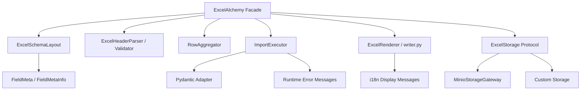
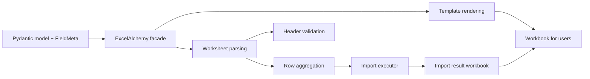

# ExcelAlchemy

[中文 README](./README_cn.md) · [About](./ABOUT.md) · [Architecture](./docs/architecture.md) · [Locale Policy](./docs/locale.md) · [Changelog](./CHANGELOG.md) · [Migration Notes](./MIGRATIONS.md)

ExcelAlchemy is a schema-driven Excel import/export library for Python.
It turns Pydantic models into Excel templates, validates spreadsheet input back into application data, and keeps the import/export workflow explicit, typed, and extensible.

This repository is also a design artifact.
It documents a series of deliberate engineering choices: `src/` layout, Pydantic v2 migration, pandas removal, pluggable storage, `uv`-based workflows, and locale-aware workbook output.

The current release track being prepared is `2.0.0rc1`, the first public release candidate for ExcelAlchemy 2.0.

## What This Project Is

- A library for building Excel workflows from typed schemas.
- A reference implementation of “facade outside, focused components inside”.
- A portfolio project that emphasizes architecture, migration strategy, and maintainability.

## What This Project Is Not

- Not a general spreadsheet analysis library.
- Not a pandas-first data wrangling tool.
- Not a GUI spreadsheet editor.
- Not a fully generic forms framework.

## Why This Exists

Many internal systems still receive business data through Excel.
The painful part is rarely “reading a file”; it is keeping templates, validation rules, row-level error reporting, and backend integration consistent across projects.

ExcelAlchemy treats Excel as a typed contract:

- the model defines the shape
- field metadata defines the workbook experience
- import execution is separated from parsing
- storage is an interchangeable strategy, not a hard-coded implementation

## Highlights

- Pydantic v2-based schema extraction and validation
- Locale-aware workbook text with `locale='zh-CN' | 'en'`
- Pluggable storage via `ExcelStorage`
- No pandas runtime dependency
- Python 3.12-3.14 support, with 3.14 as the primary target
- `uv`-based development and CI workflow
- Contract tests that protect import/export behavior during refactors

## Architecture

ExcelAlchemy exposes a small public surface and delegates the real work to internal components.



See the full breakdown in [docs/architecture.md](./docs/architecture.md).

## Workflow



## Design Principles

This repository is guided by explicit design principles rather than accidental convenience.
The full mapping is in [ABOUT.md](./ABOUT.md); the short version is:

1. Schema first.
2. Explicit metadata over implicit conventions.
3. Composition over monoliths.
4. Adapters at integration boundaries.
5. Protocols over concrete backends.
6. Progressive modernization over one-shot rewrites.
7. Runtime simplicity over hidden magic.
8. User-facing clarity over clever internals.
9. Tests should protect behavior, not implementation accidents.
10. Migration-friendly seams are part of the design.

## Quick Start

### Install

```bash
pip install ExcelAlchemy
```

If you want the built-in Minio backend:

```bash
pip install "ExcelAlchemy[minio]"
```

## Minimal Example

```python
from pydantic import BaseModel

from excelalchemy import ExcelAlchemy, FieldMeta, ImporterConfig, Number, String


class Importer(BaseModel):
    age: Number = FieldMeta(label='Age', order=1)
    name: String = FieldMeta(label='Name', order=2)


alchemy = ExcelAlchemy(ImporterConfig(Importer, locale='en'))
template_base64 = alchemy.download_template()
```

## Locale-Aware Workbook Output

`locale` affects workbook-facing display text such as:

- header hint text
- column comments
- result workbook column titles
- row validation status labels

The public locale policy is documented in [docs/locale.md](./docs/locale.md).
In short:

- runtime exceptions are standardized in English
- workbook display locales currently support `zh-CN` and `en`
- workbook display defaults to `zh-CN` for the 2.x line

```python
from excelalchemy import ExcelAlchemy, FieldMeta, ImporterConfig, Number, String
from pydantic import BaseModel


class Importer(BaseModel):
    age: Number = FieldMeta(label='Age', order=1)
    name: String = FieldMeta(label='Name', order=2)


zh_template = ExcelAlchemy(ImporterConfig(Importer, locale='zh-CN')).download_template()
en_template = ExcelAlchemy(ImporterConfig(Importer, locale='en')).download_template()
```

The same `locale` also controls import result workbooks:

```python
alchemy = ExcelAlchemy(
    ImporterConfig(
        Importer,
        creator=create_func,
        storage=storage,
        locale='en',
    )
)
result = await alchemy.import_data("people.xlsx", "people-result.xlsx")
```

## Storage Extension Point

Storage is modeled as a protocol, not a product decision.

```python
from excelalchemy import ExcelAlchemy, ExcelStorage, ExporterConfig
from excelalchemy.core.table import WorksheetTable
from excelalchemy.types.identity import UrlStr


class InMemoryExcelStorage(ExcelStorage):
    def read_excel_table(self, input_excel_name: str, *, skiprows: int, sheet_name: str) -> WorksheetTable:
        ...

    def upload_excel(self, output_name: str, content_with_prefix: str) -> UrlStr:
        ...


alchemy = ExcelAlchemy(ExporterConfig(Importer, storage=InMemoryExcelStorage()))
```

Use the built-in Minio implementation when you want it, but the library no longer requires Minio to define its architecture.

## Why These Design Choices

### Why no pandas?

ExcelAlchemy uses `openpyxl` plus an internal `WorksheetTable` abstraction.
The project was not using pandas for analysis, joins, or vectorized computation; it was mostly using it as a transport layer.
Removing pandas:

- simplified installation
- removed the `numpy` dependency chain
- made behavior more explicit
- better aligned the code with the actual problem domain

### Why a Pydantic adapter layer?

The project used to lean on Pydantic internals more directly.
That becomes fragile during major-version upgrades.
Now the design is:

- `FieldMeta` owns Excel metadata
- the Pydantic adapter reads model structure
- the adapter does not own the domain semantics

This is what made the Pydantic v2 migration practical without rewriting the public API.

### Why a facade?

The public object should stay small.
The internal object graph can evolve.
`ExcelAlchemy` is the facade; parsing, rendering, execution, storage, and schema layout are delegated to separate collaborators.

## Evolution

This repository intentionally records its evolution:

- `src/` layout migration
- CI and release modernization
- Pydantic metadata decoupling
- Pydantic v2 migration
- Python 3.12-3.14 modernization
- internal architecture split
- pandas removal
- storage abstraction
- i18n foundation and locale-aware workbook text

These are not incidental refactors; they are the story of the codebase.
See [ABOUT.md](./ABOUT.md) for the migration rationale behind each step.

## Pydantic v1 vs v2

The short version:

| Topic | v1-style risk | Current v2 design |
| --- | --- | --- |
| Field access | Tight coupling to `__fields__` / `ModelField` | Adapter over `model_fields` |
| Metadata ownership | Excel metadata mixed with validation internals | `FieldMetaInfo` owns Excel metadata |
| Validation integration | Deep reliance on internals | Adapter + explicit runtime validation |
| Upgrade path | Brittle | Layered |

More detail is documented in [ABOUT.md](./ABOUT.md).

## Docs Map

- [README.md](./README.md): product + design overview
- [README_cn.md](./README_cn.md): Chinese usage-oriented guide
- [ABOUT.md](./ABOUT.md): engineering rationale and evolution notes
- [docs/architecture.md](./docs/architecture.md): component map and boundaries

## Development

The project uses `uv` for local development and CI.

```bash
uv sync --extra development
uv run pre-commit install
uv run ruff check .
uv run pyright
uv run pytest --cov=excelalchemy --cov-report=term-missing:skip-covered tests
uv build
```

## License

MIT. See [LICENSE](./LICENSE).
