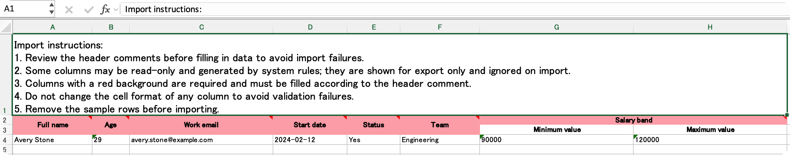
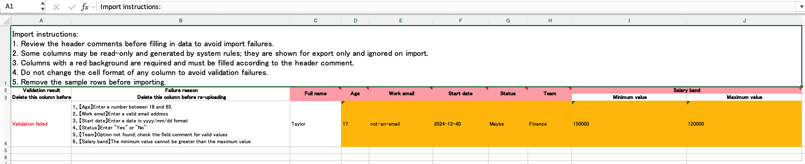

# ExcelAlchemy

[](https://github.com/RayCarterLab/ExcelAlchemy/actions/workflows/ci.yml)
[](https://app.codecov.io/gh/RayCarterLab/ExcelAlchemy)


[中文 README](README_cn.md) · [Getting Started](docs/getting-started.md) · [Examples](examples/README.md) · [Public API](docs/public-api.md) · [Migration Notes](docs/migrations.md) · [Limitations](docs/limitations.md) · [Performance](docs/performance.md) · [Changelog](CHANGELOG.md)

Repository guides: [AGENTS.md](AGENTS.md) · [Coding Agent Guide](docs/agent/coding-agent-guide.md) · [Repository Map](docs/repo-map.md) · [Package Guide](src/excelalchemy/README.md) · [Test Guide](tests/README.md)

ExcelAlchemy is a schema-driven Python library for typed Excel import/export
workflows built around Pydantic models.

Use it when you want to turn Python models into Excel workbook contracts:

- generate templates from typed schemas
- validate uploaded workbooks
- map failures back to rows and cells
- return user-friendly result workbooks
- keep storage pluggable through `ExcelStorage`

The current mainline is ExcelAlchemy 3.0. It uses ordinary Python annotations
plus explicit `ExcelColumn(...)` metadata. The old 2.x field factories,
compatibility imports, legacy config fields, and facade aliases are not current
API.

## Why This Matters

Excel import/export is often treated as a utility problem, but in internal systems it becomes a contract problem.
Templates, validation rules, row-level errors, generated result workbooks, and backend storage all need to stay aligned.

ExcelAlchemy keeps those concerns explicit: schemas define data shape, metadata defines workbook behavior, import execution is separated from parsing, and storage is handled through a protocol rather than a hard-coded backend.

## Engineering Signals

- Reusable Python library with a small facade and focused internal components.
- Typed contracts through Pydantic models and workbook metadata.
- Storage boundary via `ExcelStorage`, with Minio and custom-storage examples.
- Contract and integration tests, plus `ruff`, `pyright`, CI, and Codecov.
- Documentation for architecture, public API, result objects, locale policy, examples, migration notes, and FastAPI integration.
- Generated example assets and smoke checks that keep README examples and output artifacts honest.

## Screenshots

| Template | Import Result |
| --- | --- |
|  |  |

## Install

```bash
pip install ExcelAlchemy
```

Optional Minio-compatible storage support:

```bash
pip install "ExcelAlchemy[minio]"
```

## Quick Example

```python
from typing import Annotated

from pydantic import BaseModel, Field

from excelalchemy import EmailCodec, ExcelAlchemy, ExcelColumn, ImporterConfig


class EmployeeImport(BaseModel):
    name: Annotated[str, ExcelColumn(label='Name', order=1)]
    email: Annotated[
        str,
        Field(min_length=8),
        ExcelColumn(
            label='Email',
            codec=EmailCodec(),
            order=2,
            hint='Use your work email',
            example_value='alice@company.com',
        ),
    ]


alchemy = ExcelAlchemy(ImporterConfig(EmployeeImport, locale='en'))
template = alchemy.download_template_artifact(filename='employees-template.xlsx')

excel_bytes = template.as_bytes()
```

Python annotations define the data shape. Pydantic `Field(...)` defines
Pydantic validation. `ExcelColumn(...)` defines workbook labels, ordering,
comments, examples, and codec behavior.

For browser downloads, return `template.as_bytes()` from your backend with
`Content-Disposition: attachment`, or build a browser `Blob`. Avoid using long
top-level `data:` navigations for workbook downloads.

## Import Workflow

The shortest import path is:

```text
template -> preflight -> import -> remediation -> delivery
```

In backend code, that usually means:

```python
from excelalchemy.results import ImportLifecycleEvent, build_frontend_remediation_payload


events: list[ImportLifecycleEvent] = []

preflight = alchemy.preflight_import('employees.xlsx')
if not preflight.is_valid:
    response = {'preflight': preflight.to_api_payload()}
else:
    result = await alchemy.import_data(
        'employees.xlsx',
        'employees-result.xlsx',
        on_event=events.append,
    )
    response = {
        'result': result.to_api_payload(),
        'events': [event.model_dump(mode='json', exclude_none=True) for event in events],
        'cell_errors': alchemy.cell_error_map.to_api_payload(),
        'row_errors': alchemy.row_error_map.to_api_payload(),
        'remediation': build_frontend_remediation_payload(
            result=result,
            cell_error_map=alchemy.cell_error_map,
            row_error_map=alchemy.row_error_map,
        ),
    }
```

See [docs/getting-started.md](docs/getting-started.md) for a fuller walkthrough
and [examples/README.md](examples/README.md) for runnable examples.

## Choosing ExcelAlchemy

ExcelAlchemy is a good fit when you need a backend import/export workflow where
the spreadsheet is part of the product contract, not just a temporary file.

Use it for:

- schema-driven Excel templates and imports
- row-level and cell-level validation feedback
- server-side workbook processing without Microsoft Excel on the host
- API responses that can drive retry and remediation UI
- pluggable object storage or custom workbook IO

It is not meant for:

- desktop Excel automation
- macro execution or formula recalculation
- pandas-first data analysis
- byte-for-byte workbook round trips
- live spreadsheet editing

For a more detailed comparison with `openpyxl`, Excel automation tools, and
dataframe-first workflows, see [docs/tool-comparison.md](docs/tool-comparison.md).
For formula, fidelity, and size expectations, see
[docs/limitations.md](docs/limitations.md) and [docs/performance.md](docs/performance.md).

## Where To Go Next

- [Getting Started](docs/getting-started.md): install, define a schema, choose a workflow.
- [Examples](examples/README.md): runnable import, export, storage, and FastAPI examples.
- [Public API](docs/public-api.md): current 3.0 public modules and removed 2.x names.
- [Result Objects](docs/result-objects.md): `ImportResult`, `CellErrorMap`, `RowIssueMap`, and API payloads.
- [API Response Cookbook](docs/api-response-cookbook.md): response shapes for backend/frontend integration.
- [Integration Blueprints](docs/integration-blueprints.md): synchronous upload, worker import, and remediation loops.
- [Platform Architecture](docs/platform-architecture.md): product-layer import workflow.
- [Runtime Model](docs/runtime-model.md): preflight, import lifecycle, result surfaces, and storage behavior.
- [Migration Notes](docs/migrations.md): upgrading to 3.0 and historical upgrade notes.

## Development

This repository uses `uv` for local development and CI:

```bash
uv sync --extra development
uv run ruff format --check .
uv run ruff check .
uv run pyright
uv run pytest
```

For repository-local agent rules, start with [AGENTS.md](AGENTS.md). For a
coding-agent-oriented project brief, use
[docs/agent/coding-agent-guide.md](docs/agent/coding-agent-guide.md).

## License

MIT. See [LICENSE](LICENSE).
