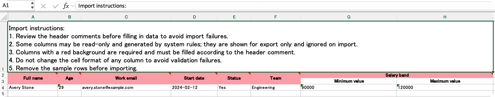
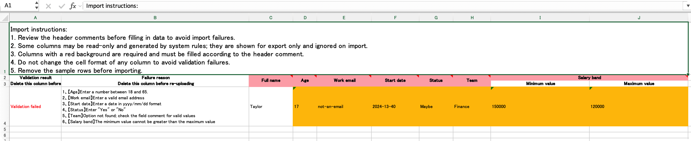
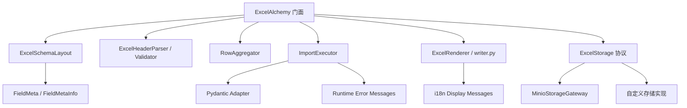
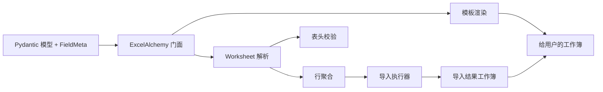

# ExcelAlchemy

[English README](./README.md) · [项目说明](./ABOUT.md) · [架构文档](./docs/architecture.md) · [Locale Policy](./docs/locale.md) · [Changelog](./CHANGELOG.md) · [迁移说明](./MIGRATIONS.md)

ExcelAlchemy 是一个面向 Excel 导入导出的 schema-first Python 库。
它的核心思路不是“读写表格文件”，而是“把 Excel 当成一种带约束的业务契约”。

当前稳定发布版本是 `2.0.0.post1`，也就是 ExcelAlchemy 2.0 稳定线的首个 post-release 更新。

你用 Pydantic 模型定义结构，用 `FieldMeta` 定义 Excel 元数据，用显式的导入/导出流程去完成模板生成、数据校验、错误回写和后端集成。

## 截图

这些截图由仓库内的 [`scripts/generate_portfolio_assets.py`](./scripts/generate_portfolio_assets.py) 生成。

| 模板 | 导入结果 |
| --- | --- |
|  |  |

## 这个项目适合什么

- 需要给业务方发 Excel 模板并回收数据
- 需要把 Excel 输入和后端模型保持一致
- 需要在失败结果中明确指出哪一格有问题
- 想要一个可以接自定义存储的 Excel 工作流库

## 这个项目不打算做什么

- 不做通用表格分析库
- 不做 pandas 风格的数据处理框架
- 不做桌面表格编辑器
- 不追求“魔法式自动推断一切”

## 核心特点

- 基于 Pydantic v2 的 schema 驱动设计
- 支持 `locale='zh-CN' | 'en'` 的 Excel 展示文案
- 支持可插拔存储后端 `ExcelStorage`
- 运行时不依赖 pandas
- 支持 Python 3.12-3.14，主支持版本是 3.14
- 使用 `uv` 管理开发与 CI

## 项目定位

这个仓库不只是“一个能用的库”，也是一个展示工程思考的作品：

- 为什么要从 Pydantic v1 迁到 v2
- 为什么要去掉 pandas
- 为什么要做 storage abstraction
- 为什么 facade 外面要简洁，里面要分层
- 为什么国际化先从消息层和 workbook display text 开始

详细设计思路见 [ABOUT.md](./ABOUT.md)。

## 架构概览



完整分层说明见 [docs/architecture.md](./docs/architecture.md)。

## 工作流概览



## 安装

```bash
pip install ExcelAlchemy
```

如果你要使用内置的 Minio 后端：

```bash
pip install "ExcelAlchemy[minio]"
```

## 快速开始

```python
from pydantic import BaseModel

from excelalchemy import ExcelAlchemy, FieldMeta, ImporterConfig, Number, String


class Importer(BaseModel):
    age: Number = FieldMeta(label='年龄', order=1)
    name: String = FieldMeta(label='姓名', order=2)


alchemy = ExcelAlchemy(ImporterConfig(Importer))
template = alchemy.download_template_artifact(filename='people-template.xlsx')

excel_bytes = template.as_bytes()
template_data_url = template.as_data_url()  # 兼容旧的浏览器集成方式
```

浏览器下载时，优先使用 `excel_bytes` 构造 `Blob`，或者让后端直接返回二进制并带上
`Content-Disposition: attachment`。现代浏览器对超长 `data:` URL 的顶层导航并不稳定。

## 选择模板 / 结果语言

`locale` 会影响 Excel 里真正给用户看的文案，例如：

- 第一行填写须知
- 表头批注
- 结果列标题
- “校验通过 / 校验不通过” 文本

默认是 `zh-CN`，如果你想生成英文模板或英文结果工作簿，可以传 `locale='en'`。

更完整的公共策略见 [docs/locale.md](./docs/locale.md)：

- 运行时异常默认并稳定使用英文
- workbook 展示文案当前支持 `zh-CN` 和 `en`
- 2.x 版本线默认 workbook locale 仍是 `zh-CN`

```python
from excelalchemy import ExcelAlchemy, FieldMeta, ImporterConfig, Number, String
from pydantic import BaseModel


class Importer(BaseModel):
    age: Number = FieldMeta(label='Age', order=1)
    name: String = FieldMeta(label='Name', order=2)


template_zh = ExcelAlchemy(ImporterConfig(Importer, locale='zh-CN')).download_template_artifact()
template_en = ExcelAlchemy(ImporterConfig(Importer, locale='en')).download_template_artifact()
```

导入结果工作簿也会使用同一个 `locale`：

```python
alchemy = ExcelAlchemy(
    ImporterConfig(
        Importer,
        creator=create_func,
        storage=storage,
        locale='en',
    )
)
result = await alchemy.import_data("people.xlsx", "people-result.xlsx")
```

## 存储扩展点

ExcelAlchemy 接受任何实现了 `ExcelStorage` 协议的存储后端。

```python
from excelalchemy import ExcelAlchemy, ExcelStorage, ExporterConfig, UrlStr
from excelalchemy.core.table import WorksheetTable


class InMemoryExcelStorage(ExcelStorage):
    def read_excel_table(self, input_excel_name: str, *, skiprows: int, sheet_name: str) -> WorksheetTable:
        ...

    def upload_excel(self, output_name: str, content_with_prefix: str) -> UrlStr:
        ...


alchemy = ExcelAlchemy(ExporterConfig(Importer, storage=InMemoryExcelStorage()))
```

如果你希望使用内置 Minio 实现，推荐显式传入 `storage=MinioStorageGateway(...)`，而不是再把 Minio 配置散落到门面层。

## 为什么这样设计

### 为什么去掉 pandas

这个项目真正需要的是：

- 读写 Excel
- 一个稳定的中间表格抽象
- 对表头 / 行 / 错误坐标的精确控制

并不需要 pandas 擅长的分析能力。
因此改成 `openpyxl + WorksheetTable` 更贴合问题域，也让安装和依赖稳定性更好。

### 为什么做 Pydantic adapter

Excel 元数据不应该深绑到 Pydantic 内部结构上。
所以现在的分层是：

- `FieldMetaInfo` 负责 Excel 元数据
- `helper/pydantic.py` 只做适配
- 真正的业务校验仍然由 ExcelAlchemy 控制

这就是为什么 Pydantic v2 迁移可以做得比较稳。

### 为什么做 storage abstraction

这个项目不应该等于 Minio。
Minio 只是一个默认实现，真正稳定的接口应该是 `ExcelStorage`。

这样用户可以接：

- 对象存储
- 本地文件系统
- 测试替身
- 内存存储

## 演进记录

这个仓库的价值，很大一部分来自它的演进过程：

- `src/` layout 迁移
- CI / 发布链路现代化
- Pydantic 元数据层解耦
- Pydantic v2 迁移
- Python 3.12-3.14 现代化
- 核心架构拆分
- 去 pandas 化
- 存储抽象化
- 国际化基础层与 workbook locale 化

这些不是零碎优化，而是整套工程判断的痕迹。

## 文档索引

- [README.md](./README.md): 英文首页，偏作品集表达
- [README_cn.md](./README_cn.md): 中文说明页，偏使用和理解
- [ABOUT.md](./ABOUT.md): 设计原则、迁移记录、架构取舍
- [docs/architecture.md](./docs/architecture.md): 组件边界与扩展点

## 开发

```bash
uv sync --extra development
uv run pre-commit install
uv run ruff check .
uv run pyright
uv run pytest --cov=excelalchemy --cov-report=term-missing:skip-covered tests
uv build
```

## 许可证

MIT。详见 [LICENSE](./LICENSE)。
