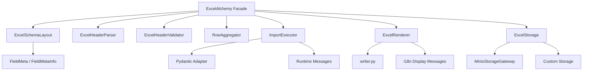

# Architecture

## Component Map

## Layer Responsibilities

### Facade

`src/excelalchemy/core/alchemy.py`

- owns the user-facing workflow
- coordinates import/export operations
- keeps the top-level API compact

### Schema

`src/excelalchemy/core/schema.py`

- extracts Excel-facing layout from models
- expands composite fields
- validates ordering assumptions

### Headers

`src/excelalchemy/core/headers.py`

- parses simple and merged headers
- validates workbook header rows against schema layout

### Rows

`src/excelalchemy/core/rows.py`

- aggregates flattened worksheet rows back into model-shaped payloads
- maps row/cell errors back into workbook coordinates

### Executor

`src/excelalchemy/core/executor.py`

- validates row payloads
- dispatches create/update/upsert logic
- isolates backend execution from parsing concerns

### Rendering

`src/excelalchemy/core/rendering.py`
`src/excelalchemy/core/writer.py`

- turns worksheet tables into workbook payloads
- applies comments, colors, result columns, and workbook hint text

### Storage

`src/excelalchemy/core/storage_protocol.py`
`src/excelalchemy/core/storage.py`
`src/excelalchemy/core/storage_minio.py`

- defines a stable storage contract
- resolves configured storage strategy
- ships one built-in Minio implementation

### Metadata

`src/excelalchemy/types/field.py`

- owns Excel field metadata
- exposes workbook comment fragments
- keeps runtime metadata separate from validation backend internals

### Pydantic Integration

`src/excelalchemy/helper/pydantic.py`

- adapts Pydantic models to ExcelAlchemy needs
- shields the rest of the codebase from version-specific framework details

### Internationalization

`src/excelalchemy/i18n/messages.py`

- separates runtime errors from workbook display text
- provides locale-aware workbook-facing messages

## Extension Points

### Custom Storage

Implement `ExcelStorage` when you want a different backend.

### Custom Value Types

Implement a new `ABCValueType` or `ComplexABCValueType` when you want custom workbook semantics.

### Data Conversion

Use `data_converter` when the workbook schema should not map 1:1 to backend payloads.

### Locale

Use `locale='zh-CN' | 'en'` to control workbook-facing display text without changing runtime exception language.

## Architectural Intent

The codebase is designed around stable seams:

- facade vs collaborators
- metadata vs validation backend
- storage protocol vs concrete storage
- workbook display text vs runtime messages

Those seams are what made the later migrations possible without rewriting the whole project.
