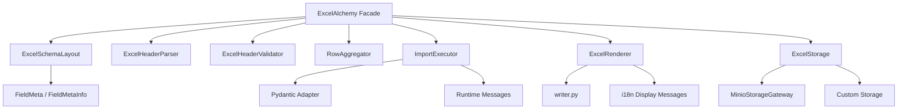
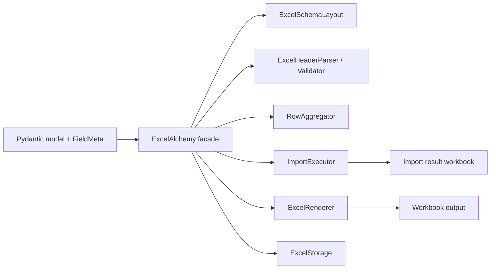

# Architecture

This page is the internal component view of the repository.
If you want the integration-oriented platform view introduced for the v2.4
documentation slice, see [`docs/platform-architecture.md`](platform-architecture.md).
If you want the runtime sequence on top of that platform view, see
[`docs/runtime-model.md`](runtime-model.md).

## Component Map

## Workflow Map

## Layer Responsibilities

### Facade

`src/excelalchemy/core/alchemy.py`

- owns the user-facing workflow
- coordinates import/export operations
- keeps the top-level API compact
- exposes `import_data(..., on_event=...)` as an additive progress-reporting
  hook for import runs

### Schema

`src/excelalchemy/core/schema.py`

- extracts Excel-facing layout from models
- expands composite fields
- validates ordering assumptions

### Headers

`src/excelalchemy/core/headers.py`

- parses simple and merged headers
- validates workbook header rows against schema layout

### Rows

`src/excelalchemy/core/rows.py`

- aggregates flattened worksheet rows back into model-shaped payloads
- maps row/cell errors back into workbook coordinates

### Executor

`src/excelalchemy/core/executor.py`

- validates row payloads
- dispatches create/update/upsert logic
- isolates backend execution from parsing concerns

### Import Session

`src/excelalchemy/core/import_session.py`

- owns one import run's lifecycle and mutable runtime state
- emits structured lifecycle events when `on_event=...` is supplied
- keeps those events on the same synchronous path as header validation, row
  execution, and result workbook rendering

### Rendering

`src/excelalchemy/core/rendering.py`
`src/excelalchemy/core/writer.py`

- turns worksheet tables into workbook payloads
- applies comments, colors, result columns, and workbook hint text

### Storage

`src/excelalchemy/core/storage_protocol.py`
`src/excelalchemy/core/storage.py`
`src/excelalchemy/core/storage_minio.py`

- defines a stable storage contract
- resolves configured storage strategy
- ships one built-in Minio implementation

### Metadata

`src/excelalchemy/metadata.py`

- exposes `FieldMeta(...)` / `ExcelMeta(...)` as the stable public entry points
- keeps `FieldMetaInfo` as a compatibility facade for the 2.x line
- splits the real metadata state into declaration, runtime binding,
  workbook presentation, and import-constraint layers
- keeps runtime metadata separate from validation backend internals

### Pydantic Integration

`src/excelalchemy/helper/pydantic.py`

- adapts Pydantic models to ExcelAlchemy needs
- shields the rest of the codebase from version-specific framework details

### Internationalization

`src/excelalchemy/i18n/messages.py`

- separates runtime errors from workbook display text
- provides locale-aware workbook-facing messages

## Extension Points

### Custom Storage

Implement `ExcelStorage` when you want a different backend.

### Custom Field Codecs

Implement a new `ExcelFieldCodec` or `CompositeExcelFieldCodec` when you want custom workbook semantics.
Built-in field annotations keep concise aliases like `Email` and `DateRange`, while the `*Codec` names expose the adapter role more explicitly.

### Field Declaration Styles

Both declaration styles are supported:

- `FieldMeta(...)` as the concise compatibility-friendly syntax sugar
- `Annotated[T, Field(...), ExcelMeta(...)]` as the more explicit Pydantic v2-first style

### Data Conversion

Use `data_converter` when the workbook schema should not map 1:1 to backend payloads.

### Locale

Use `locale='zh-CN' | 'en'` to control workbook-facing display text without changing runtime exception language.

## Module Layout

- `src/excelalchemy/codecs/`: built-in Excel field codecs and codec base abstractions
- `src/excelalchemy/metadata.py`: Excel-specific field metadata and declaration helpers
- `src/excelalchemy/config.py`: importer/exporter configuration models
- `src/excelalchemy/exceptions.py`: public exception types
- `src/excelalchemy/_primitives/identity.py`: private typed string and index wrappers used across the core layer
- `src/excelalchemy/_primitives/constants.py`: private constant and enum definitions
- `src/excelalchemy/results.py`: import/export result models
- `src/excelalchemy/_primitives/header_models.py`: private workbook header model objects
- `src/excelalchemy/_primitives/deprecation.py`: private deprecation helpers used by compatibility shims
- `src/excelalchemy/types/`: compatibility import layer for pre-refactor paths
- `src/excelalchemy/exc.py`, `src/excelalchemy/identity.py`, `src/excelalchemy/header_models.py`, `src/excelalchemy/const.py`: compatibility or low-level facade modules kept at the package root

Compatibility policy:

- `excelalchemy.types.*` and `excelalchemy.types.value.*` remain available throughout the 2.x line
- those imports emit `ExcelAlchemyDeprecationWarning` at import time
- the compatibility layer is scheduled for removal in ExcelAlchemy 3.0
- `excelalchemy.exc` now points to the public `excelalchemy.exceptions` module
- `excelalchemy.identity` and `excelalchemy.header_models` remain as 2.x compatibility imports; prefer the package root or internal modules only

## Architectural Intent

The codebase is designed around stable seams:

- facade vs collaborators
- metadata vs validation backend
- storage protocol vs concrete storage
- workbook display text vs runtime messages

Those seams are what made the later migrations possible without rewriting the whole project.
