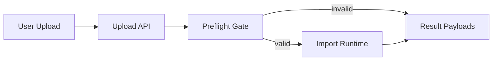
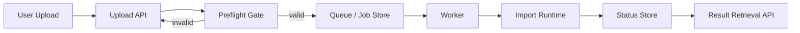
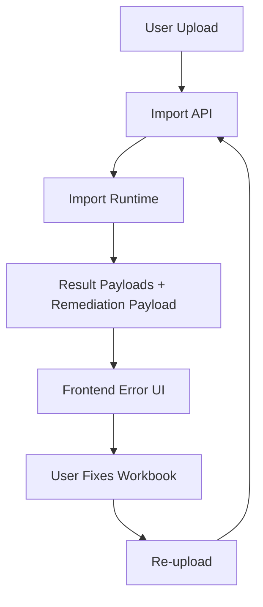

# Integration Blueprints

This page shows practical ways to compose the current ExcelAlchemy 2.x import
capabilities into backend and frontend integration flows.
It is not an API reference.
It is a set of blueprint-style patterns that backend engineers can adapt to
their own services.

If you want the platform view first, see
[`docs/platform-architecture.md`](platform-architecture.md).
If you want the runtime semantics behind these patterns, see
[`docs/runtime-model.md`](runtime-model.md).
If you want detailed result payloads, see
[`docs/result-objects.md`](result-objects.md) and
[`docs/api-response-cookbook.md`](api-response-cookbook.md).

## Overview

ExcelAlchemy’s import platform is most useful when it is treated as a set of
composable stages rather than a single upload helper.

The common integration questions are:

- should the API reject a workbook before full execution
- should the import run directly in the request path or inside a worker
- how should status be exposed while the import is running
- how should a frontend guide the user through correction and re-upload

The blueprints below are based on the current public surfaces only.
They do not introduce a new runtime model, job system, or transport layer.

## Blueprint 1: Simple Synchronous Upload

Use this pattern when:

- the upload path is short enough to run in the request lifecycle
- the backend wants one immediate result response
- the application does not need queue-based orchestration

### Flow

1. receive the uploaded workbook reference
2. run preflight
3. stop early if the workbook is structurally invalid
4. run import synchronously
5. return the result payloads directly



### Pseudocode

```python
alchemy = ExcelAlchemy(
    ImporterConfig.for_create(
        EmployeeImporter,
        creator=create_employee,
        storage=storage,
        locale='en',
    )
)

preflight = alchemy.preflight_import('employees.xlsx')
if not preflight.is_valid:
    return {
        'preflight': preflight.to_api_payload(),
    }

result = await alchemy.import_data('employees.xlsx', 'employees-result.xlsx')

return {
    'preflight': preflight.to_api_payload(),
    'result': result.to_api_payload(),
    'cell_errors': alchemy.cell_error_map.to_api_payload(),
    'row_errors': alchemy.row_error_map.to_api_payload(),
}
```

### APIs used

- `ImporterConfig.for_create(...)` or another `ImporterConfig` constructor
- `ExcelAlchemy.preflight_import(...)`
- `ImportPreflightResult.to_api_payload()`
- `ExcelAlchemy.import_data(...)`
- `ImportResult.to_api_payload()`
- `CellErrorMap.to_api_payload()`
- `RowIssueMap.to_api_payload()`

### Why this design works

- preflight gives a cheap structural rejection step before the full runtime
- import remains the only real execution path
- result objects provide enough detail for most backend responses without extra
  abstraction
- this pattern is easy to reason about and easy to test

### When not to use it

- imports are too slow for the request path
- the application needs retry scheduling or out-of-band execution
- the frontend expects progress updates during a long-running operation

## Blueprint 2: Worker-based Import

Use this pattern when:

- the application already has a worker or queue system
- imports may take long enough that request/response execution is undesirable
- the service wants progress or status reporting outside the original request

This is an application-level worker pattern.
It is not a claim that ExcelAlchemy provides a worker framework.

### Flow

1. receive the uploaded workbook reference
2. run preflight in the request path
3. enqueue a job only if preflight succeeds
4. let the worker run `import_data(...)`
5. use lifecycle events to update worker progress
6. persist final result payloads for polling or retrieval



### Pseudocode

```python
# request path
alchemy = build_alchemy(storage=storage)

preflight = alchemy.preflight_import('employees.xlsx')
if not preflight.is_valid:
    return {
        'status': 'rejected',
        'preflight': preflight.to_api_payload(),
    }

job_id = enqueue_import_job(input_name='employees.xlsx', output_name='employees-result.xlsx')
return {
    'status': 'queued',
    'job_id': job_id,
    'preflight': preflight.to_api_payload(),
}
```

```python
# worker path
alchemy = build_alchemy(storage=storage)

def handle_event(event: dict[str, object]) -> None:
    update_job_progress(job_id, event)

result = await alchemy.import_data(
    'employees.xlsx',
    'employees-result.xlsx',
    on_event=handle_event,
)

store_job_result(
    job_id,
    result=result.to_api_payload(),
    cell_errors=alchemy.cell_error_map.to_api_payload(),
    row_errors=alchemy.row_error_map.to_api_payload(),
)
```

### APIs used

- `ExcelAlchemy.preflight_import(...)`
- `ExcelAlchemy.import_data(..., on_event=...)`
- lifecycle events emitted through `on_event`
- `ImportResult.to_api_payload()`
- `CellErrorMap.to_api_payload()`
- `RowIssueMap.to_api_payload()`

### Why this design works

- preflight prevents obviously bad workbooks from entering the queue
- the worker owns scheduling, retries, and durability outside the library
- lifecycle events provide a practical status projection during execution
- result payloads remain stable and can be stored or exposed after completion

### Important boundary

- the queue, job state, retries, and polling API belong to the application
- ExcelAlchemy still runs as a synchronous import engine inside the worker
- lifecycle events are useful progress signals, not a transactional event bus

## Blueprint 3: Frontend Remediation Loop

Use this pattern when:

- the frontend needs to help the user correct invalid workbook data
- the backend wants to return both structured failures and retry guidance
- the user is expected to re-upload a corrected workbook

### Flow

1. run the import
2. return top-level result objects plus remediation payload
3. frontend shows grouped error information
4. user fixes the workbook
5. user re-uploads and repeats the flow



### Pseudocode

```python
alchemy = build_alchemy(storage=storage)

result = await alchemy.import_data('employees.xlsx', 'employees-result.xlsx')

return {
    'result': result.to_api_payload(),
    'cell_errors': alchemy.cell_error_map.to_api_payload(),
    'row_errors': alchemy.row_error_map.to_api_payload(),
    'remediation': build_frontend_remediation_payload(
        result=result,
        cell_error_map=alchemy.cell_error_map,
        row_error_map=alchemy.row_error_map,
    ),
}
```

### APIs used

- `ExcelAlchemy.import_data(...)`
- `ImportResult.to_api_payload()`
- `CellErrorMap.to_api_payload()`
- `RowIssueMap.to_api_payload()`
- `build_frontend_remediation_payload(...)`

### Why this design works

- `ImportResult` gives the frontend the top-level outcome
- `CellErrorMap` gives precise workbook-coordinate failures
- `RowIssueMap` gives grouped row-oriented summaries
- remediation payload adds a thinner retry-oriented layer without replacing the
  stable result surfaces

### Recommended frontend responsibilities

- use `result` for banners and top-level state
- use `cell_errors` for precise field/cell highlighting
- use `row_errors` for grouped row tables and summaries
- use `remediation` for compact next-step guidance
- offer the result workbook download when the result workbook URL is available

### Important boundary

- remediation payloads are additive
- they do not replace the stable core result contracts
- they are intentionally conservative rather than automatic fix instructions

## Choosing the Right Blueprint

- choose `Simple Synchronous Upload` when the request path can safely carry the
  import runtime
- choose `Worker-based Import` when the application needs queue-backed
  orchestration and progress tracking
- choose `Frontend Remediation Loop` when the main product need is rapid user
  correction and re-upload

These blueprints are compatible with the same platform order:

1. template authoring
2. preflight gate
3. import runtime
4. result intelligence
5. artifact / delivery

The difference is where the application places the boundaries between those
stages.

## Recommended Reading

- [`docs/platform-architecture.md`](platform-architecture.md)
- [`docs/runtime-model.md`](runtime-model.md)
- [`docs/result-objects.md`](result-objects.md)
- [`docs/api-response-cookbook.md`](api-response-cookbook.md)
