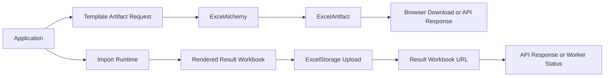

# Integration Blueprints

This page shows practical integration blueprints for the v2.4 import platform
layer.
These are not new product surfaces.
They are recommended ways to compose the current 2.x capabilities.

If you want the platform capability map, see
[`docs/platform-architecture.md`](platform-architecture.md).
If you want the runtime sequence view, see
[`docs/runtime-model.md`](runtime-model.md).
If you want detailed result payload shapes, see
[`docs/result-objects.md`](result-objects.md) and
[`docs/api-response-cookbook.md`](api-response-cookbook.md).

## Blueprint 1: Backend Worker Import Flow

Use this blueprint when your application already has a worker, queue, or job
runner and you want ExcelAlchemy to remain the import engine inside that worker.

This is an application-level worker blueprint.
It is not a claim that ExcelAlchemy ships a worker framework.

### Recommended shape

```mermaid
flowchart LR
    U[Spreadsheet User] --> API[Upload API]
    API --> PF[Preflight Gate]
    PF -->|valid| Q[App Queue / Worker Trigger]
    PF -->|invalid| PFR[Preflight Response]

    Q --> W[Backend Worker]
    W --> EA[ExcelAlchemy import_data(..., on_event=...)]
    EA --> RES[ImportResult + Issue Maps]
    EA --> OUT[Result Workbook Upload]
    RES --> APIRES[API Status Store / Polling Endpoint]
    OUT --> APIRES
```

### Why this fits the current platform

- preflight stays a lightweight synchronous gate
- the worker owns application scheduling and retries
- `import_data(..., on_event=...)` remains the real runtime entry point
- lifecycle events can update application job status inline
- result intelligence remains post-import and machine-readable

### Recommended responsibilities

Upload API:

- accept the workbook reference
- run `preflight_import(...)`
- reject obvious structural failures early
- enqueue only structurally importable workbooks

Backend worker:

- call `import_data(..., on_event=...)`
- update job status using lifecycle events
- persist `ImportResult`
- persist row/cell issue payloads when needed
- expose result workbook URL when one is produced

Application status endpoint:

- return job state
- return final result payloads
- optionally expose remediation payloads for UI consumers

### Important boundaries

- the queue, worker, retry policy, and job persistence belong to the
  application
- ExcelAlchemy remains synchronous inside the worker execution
- do not describe this as an ExcelAlchemy job subsystem

## Blueprint 2: Frontend Remediation Flow

Use this blueprint when a frontend needs both high-level outcome information and
compact retry guidance after a failed import.

```mermaid
flowchart TD
    U[Spreadsheet User] --> FE[Frontend]
    FE --> API[Backend API]
    API --> PF[preflight_import(...)]

    PF -->|invalid| PRE[ImportPreflightResult payload]
    PF -->|valid| RUN[import_data(...)]

    RUN --> R[ImportResult]
    RUN --> C[CellErrorMap]
    RUN --> RI[RowIssueMap]
    RUN --> RP[build_frontend_remediation_payload(...)]
    RUN --> URL[result workbook URL]

    PRE --> FE
    R --> FE
    C --> FE
    RI --> FE
    RP --> FE
    URL --> FE
```

### Recommended frontend use

Preflight response:

- decide whether the workbook is structurally importable
- show blocking sheet/header problems before full execution

Result response:

- use `ImportResult` for high-level outcome and counts
- use `CellErrorMap` for precise field/cell UI highlighting
- use `RowIssueMap` for list/table summaries
- use the remediation payload for concise retry guidance
- use the result workbook URL when the user should download the annotated file

### Recommended response layering

- `preflight`
  - structural gate result only
- `result`
  - overall import outcome
- `cell_errors`
  - precise workbook-coordinate issues
- `row_errors`
  - grouped row summaries
- `remediation`
  - optional condensed retry guidance

### Important boundaries

- remediation payloads are additive and opt-in
- they do not replace the stable result payloads
- they should stay conservative and avoid overstating automatic fix guidance

## Blueprint 3: Artifact Delivery Flow

Use this blueprint when delivery of the template artifact and result workbook is
part of the integration design.



### What this highlights

- template authoring and result delivery share rendering primitives
- artifact delivery is a platform stage even though it depends on earlier
  stages
- storage remains a seam rather than a mandated backend

## Choosing The Right Blueprint

- use the backend worker blueprint when your application already has queued or
  long-running import orchestration
- use the frontend remediation blueprint when the UI needs compact retry
  guidance after validation failures
- use the artifact delivery blueprint when file delivery semantics are a first
  class part of the integration

In all three cases, keep the same platform order:

1. template authoring
2. preflight gate
3. import runtime
4. result intelligence
5. artifact and delivery

## Recommended Reading

- [`docs/platform-architecture.md`](platform-architecture.md)
- [`docs/runtime-model.md`](runtime-model.md)
- [`docs/result-objects.md`](result-objects.md)
- [`docs/api-response-cookbook.md`](api-response-cookbook.md)
