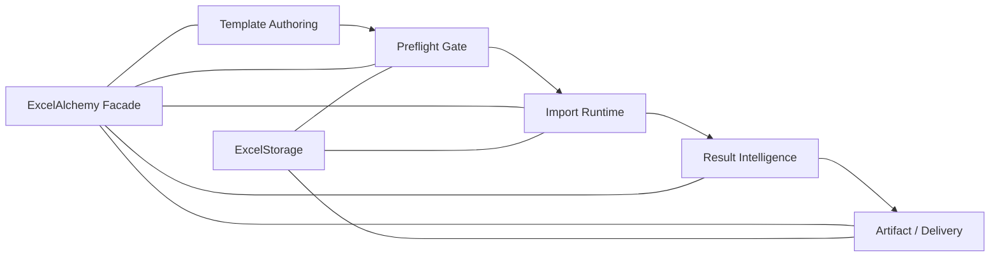
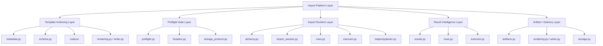

# Platform Architecture

This page describes the `Import Platform Layer` in ExcelAlchemy 2.x.
It does not introduce a new subsystem.
It explains how the library’s existing import-related capabilities fit together
as one practical backend integration model.

Use this page when you want to answer:

- how to structure an import flow with the current public API
- where template guidance, preflight, runtime execution, result inspection, and
  artifact delivery fit together
- how the platform view differs from the internal component view

If you want the internal module map, see
[`docs/architecture.md`](architecture.md).
If you want the runtime sequence in more detail, see
[`docs/runtime-model.md`](runtime-model.md).
If you want blueprint-style backend and frontend integration patterns, see
[`docs/integration-blueprints.md`](integration-blueprints.md).

## Overview

Excel import workflows usually fail when the system treats upload validation as
one isolated function call.
In practice, a production-ready import flow needs to answer several different
questions:

- how do users know what the workbook should contain before upload
- how do you reject structurally wrong workbooks early
- how do you run the real import path and observe its progress
- how do you expose failure detail to APIs, admin tools, or frontends
- how do you return or upload the generated workbook artifacts

ExcelAlchemy already provides these capabilities in the 2.x line.
The `Import Platform Layer` is a high-level view that organizes them into one
coherent flow without changing the underlying architecture or public API.

At this level, the platform is:

1. `Template Authoring`
2. `Preflight Gate`
3. `Import Runtime`
4. `Result Intelligence`
5. `Artifact / Delivery`

This view is intended for backend engineers who need to build an import process
with clear stage boundaries while staying on the stable public surfaces.

## High-level Flow

At the highest level, the recommended import flow is:

1. author a template contract
2. run a lightweight preflight gate
3. execute the synchronous import runtime
4. inspect structured result intelligence
5. deliver artifacts and URLs through the storage seam

In practical terms:

- template authoring uses schema metadata such as `hint` and `example_value`
- preflight uses `preflight_import(...)` to stop structurally invalid uploads
  early
- import runtime uses `import_data(..., on_event=...)` for real validation and
  execution
- result intelligence uses `ImportResult`, `CellErrorMap`, `RowIssueMap`, and
  the remediation payload helper
- artifact and delivery use `ExcelArtifact`, result workbook rendering, and
  `ExcelStorage`

This flow is additive rather than monolithic:

- template guidance improves the workbook before upload
- preflight gives a cheap structural decision before full execution
- runtime does the real import work
- result intelligence explains what happened after the run
- delivery exposes the generated files and URLs

## Platform Layers

### Template Authoring Layer

Responsibility:

- define the workbook contract before upload
- make templates easier for spreadsheet users to complete correctly

Typical inputs:

- Pydantic schema models
- `FieldMeta(...)` or `ExcelMeta(...)`
- workbook-facing metadata such as:
  - `label`
  - `order`
  - `hint`
  - `example_value`

Typical outputs:

- generated template workbooks
- `ExcelArtifact` outputs when artifact helpers are used
- a clearer workbook contract for later upload

Primary public surfaces:

- `FieldMeta(...)`
- `ExcelMeta(...)`
- `ExcelAlchemy.download_template(...)`
- `ExcelAlchemy.download_template_artifact(...)`

Relationship to other layers:

- provides the workbook contract that later drives preflight and import runtime
- does not validate uploaded workbooks
- does not execute row callbacks

Important boundary:

- Template UX metadata is additive.
- `hint` and `example_value` improve workbook guidance without changing the
  import execution model.

### Preflight Gate Layer

Responsibility:

- answer whether a workbook is structurally importable before full execution

Typical inputs:

- configured schema and worksheet expectations
- an uploaded workbook name resolved through `ExcelStorage`

Typical outputs:

- `ImportPreflightResult`
- a structural decision such as:
  - valid
  - header invalid
  - sheet missing
  - structure invalid

Primary public surfaces:

- `ExcelAlchemy.preflight_import(...)`
- `ImportPreflightResult`

Relationship to other layers:

- sits between template authoring and the full import runtime
- uses the same workbook contract as the import runtime
- should usually run before `import_data(...)` when early structural rejection
  is valuable

Important boundary:

- Preflight is lightweight and structural.
- It does not perform row-level validation, callback execution, or remediation
  analysis.

### Import Runtime Layer

Responsibility:

- execute the real import flow synchronously
- validate rows and dispatch configured create/update behavior
- expose additive lifecycle visibility during the run

Typical inputs:

- a structurally importable workbook
- `ImporterConfig`
- create/update/create-or-update callbacks
- optional `on_event` lifecycle handler

Typical outputs:

- executed row operations
- result workbook generation when applicable
- runtime events such as:
  - `started`
  - `header_validated`
  - `row_processed`
  - `completed`
  - `failed`

Primary public surfaces:

- `ExcelAlchemy.import_data(..., on_event=...)`
- `ImporterConfig.for_create(...)`
- `ImporterConfig.for_update(...)`
- `ImporterConfig.for_create_or_update(...)`
- `ImportMode`

Relationship to other layers:

- depends on the same schema contract used by template authoring and preflight
- produces the raw material for result intelligence
- may trigger result workbook rendering for later delivery

Important boundary:

- The import runtime is synchronous-first.
- `on_event=...` is an additive observability hook, not a separate job system
  or streaming execution engine.

### Result Intelligence Layer

Responsibility:

- convert one import run into structured, machine-readable post-run outputs
- support backend APIs, admin review flows, and frontend remediation UIs

Typical inputs:

- the completed import run
- header issues, row issues, and cell issues collected by the runtime

Typical outputs:

- `ImportResult`
- `CellErrorMap`
- `RowIssueMap`
- remediation-oriented payloads built from existing result objects

Primary public surfaces:

- `ImportResult`
- `CellErrorMap`
- `RowIssueMap`
- `build_frontend_remediation_payload(...)`

Relationship to other layers:

- depends on runtime execution having already happened
- feeds backend responses, admin tooling, and frontend retry flows
- works alongside artifact delivery when a result workbook is produced

Important boundary:

- Result intelligence is post-import consumption.
- It does not change the runtime pipeline, and the remediation payload is
  additive rather than a replacement for the default stable result surfaces.

### Artifact / Delivery Layer

Responsibility:

- return or upload the files produced by the earlier layers
- provide stable delivery seams for templates and result workbooks

Typical inputs:

- generated template workbooks
- generated result workbooks
- configured `ExcelStorage`

Typical outputs:

- `ExcelArtifact`
- uploaded workbook URLs
- result workbook URLs exposed through `ImportResult`

Primary public surfaces:

- `ExcelArtifact`
- `ExcelStorage`
- template artifact helpers
- result workbook URL access through `ImportResult`

Relationship to other layers:

- receives artifacts from template authoring and import runtime
- relies on the storage seam for delivery concerns
- is the stage where the platform hands outputs back to the application

Important boundary:

- `ExcelStorage` is the delivery seam.
- It is not a Minio-only architecture and should not be described as one.

## Relationship to Internal Architecture

The `Import Platform Layer` is built on top of the existing facade-and-
collaborators architecture.
It is not a second implementation tree.

Use the platform view to understand how to build an import flow.
Use [`docs/architecture.md`](architecture.md) to understand which internal
modules own the behavior.

The mapping is intentionally simple:

- `Template Authoring Layer`
  - primarily maps to metadata, schema layout, codecs, rendering, and writer
    collaborators
- `Preflight Gate Layer`
  - primarily maps to the dedicated preflight path, header parsing/validation,
    and storage-backed workbook reading
- `Import Runtime Layer`
  - primarily maps to the facade entry point, import session, row preparation,
    executor, and Pydantic adaptation boundary
- `Result Intelligence Layer`
  - primarily maps to `results.py` plus the issue collection and result-mapping
    work done by the runtime
- `Artifact / Delivery Layer`
  - primarily maps to artifact wrappers, workbook rendering, and the storage
    protocol / storage gateway path

This is the key distinction:

- `docs/architecture.md`
  - explains internal collaborators and ownership
- `docs/platform-architecture.md`
  - explains how a backend engineer should compose the existing capabilities
    into one import flow

## Design Principles

The current platform should be understood through a few explicit principles.

### Additive

Recent import-facing capabilities extend the existing workflow rather than
replace it.

Examples:

- template UX metadata extends workbook guidance
- preflight adds an early structural gate
- lifecycle events add observability to the same import call
- remediation payloads add a thinner frontend-oriented view on top of stable
  result objects

### Synchronous-first

The core import runtime remains synchronous in library terms.
Applications may wrap it in workers or job systems, but the library itself does
not introduce a separate async orchestration model here.

### Schema-driven

The same schema and metadata contract drives:

- template generation
- preflight expectations
- import validation
- error mapping
- result rendering

This is what keeps the platform coherent instead of turning it into a set of
unrelated helpers.

### Separation of concerns

Each layer answers a different integration question:

- template authoring:
  what should the workbook look like before upload
- preflight gate:
  is the workbook structurally importable
- import runtime:
  can the system validate and execute the import
- result intelligence:
  what happened and how should the application inspect it
- artifact / delivery:
  how do generated files and URLs leave the library

### Stable public surfaces over internal coupling

The platform view should be built from the stable public API:

- `excelalchemy`
- `excelalchemy.config`
- `excelalchemy.metadata`
- `excelalchemy.results`
- `ExcelStorage`

Internal modules remain implementation details even when they are helpful for
understanding the architecture.

## What This Page Does Not Claim

- It does not introduce a new async or job system.
- It does not redefine the import runtime.
- It does not replace `docs/architecture.md`.
- It does not add a new execution engine or storage abstraction.
- It does not change existing public APIs.

## Recommended Reading

- [`docs/runtime-model.md`](runtime-model.md)
- [`docs/integration-blueprints.md`](integration-blueprints.md)
- [`docs/public-api.md`](public-api.md)
- [`docs/result-objects.md`](result-objects.md)
- [`docs/architecture.md`](architecture.md)
