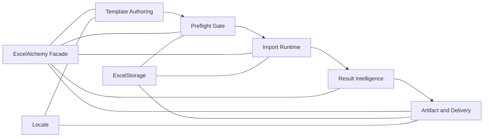
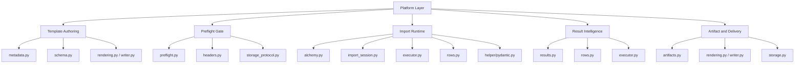

# Platform Architecture

This page describes the import platform layer in ExcelAlchemy 2.x.
It sits above the internal component map documented in
[`docs/architecture.md`](architecture.md).

Use this page when you want to answer:

- what the import platform capabilities are
- how those capabilities compose into one workflow
- which public APIs belong to each capability layer
- how the platform view differs from the internal component view

If you want the internal module breakdown, see
[`docs/architecture.md`](architecture.md).
If you want the runtime sequence in more detail, see
[`docs/runtime-model.md`](runtime-model.md).
If you want integration examples and blueprint-style guidance, see
[`docs/integration-blueprints.md`](integration-blueprints.md).

## Platform Model

ExcelAlchemy’s import platform is best understood as five capability stages:

1. template authoring
2. preflight gate
3. import runtime
4. result intelligence
5. artifact and delivery

These stages are layered on top of the existing facade-and-collaborators design.
They do not replace the internal architecture. They group the current public
capabilities into an integration-oriented model.

## Capability Layers

### 1. Template Authoring

Purpose:

- define the workbook contract before upload
- make the template self-explanatory for spreadsheet users

Primary public surfaces:

- schema models
- `FieldMeta(...)`
- `ExcelMeta(...)`
- `ExcelAlchemy.download_template(...)`
- `ExcelAlchemy.download_template_artifact(...)`

Current capability boundary:

- additive workbook guidance such as `hint` and `example_value`
- workbook-facing labels, ordering, and field semantics
- no row execution
- no upload validation

Internal alignment:

- `src/excelalchemy/metadata.py`
- `src/excelalchemy/core/schema.py`
- `src/excelalchemy/core/rendering.py`
- `src/excelalchemy/core/writer.py`
- `src/excelalchemy/codecs/`

### 2. Preflight Gate

Purpose:

- answer whether a workbook is structurally importable before full execution

Primary public surfaces:

- `ExcelAlchemy.preflight_import(...)`
- `ImportPreflightResult`

Current capability boundary:

- sheet existence
- header validity
- lightweight structural checks
- estimated row count
- no row-level validation
- no callback execution
- no remediation payload construction

Internal alignment:

- `src/excelalchemy/core/preflight.py`
- `src/excelalchemy/core/headers.py`
- `src/excelalchemy/core/schema.py`
- `src/excelalchemy/core/storage_protocol.py`

### 3. Import Runtime

Purpose:

- execute the real import flow
- keep runtime visibility additive and synchronous

Primary public surfaces:

- `ExcelAlchemy.import_data(..., on_event=...)`
- `ImporterConfig.for_create(...)`
- `ImporterConfig.for_update(...)`
- `ImporterConfig.for_create_or_update(...)`
- `ImportMode`

Current capability boundary:

- row preparation and validation
- create/update/create-or-update dispatch
- inline lifecycle events
- result workbook rendering decisions
- no job framework
- no streaming runtime model

Internal alignment:

- `src/excelalchemy/core/import_session.py`
- `src/excelalchemy/core/executor.py`
- `src/excelalchemy/core/rows.py`
- `src/excelalchemy/helper/pydantic.py`

### 4. Result Intelligence

Purpose:

- turn one import run into structured signals for APIs, admin tools, and
  frontend remediation flows

Primary public surfaces:

- `ImportResult`
- `CellErrorMap`
- `RowIssueMap`
- `build_frontend_remediation_payload(...)`

Current capability boundary:

- top-level outcome classification
- header issue exposure
- cell-level and row-level issue inspection
- grouped summaries and API payload helpers
- conservative, opt-in remediation guidance

Internal alignment:

- `src/excelalchemy/results.py`
- issue production paths in `src/excelalchemy/core/rows.py`
- execution result mapping in `src/excelalchemy/core/executor.py`

### 5. Artifact and Delivery

Purpose:

- deliver platform outputs to callers, storage backends, and downstream systems

Primary public surfaces:

- `ExcelArtifact`
- template artifact helpers
- result workbook URL on `ImportResult`
- `ExcelStorage`

Current capability boundary:

- template bytes or artifact delivery
- result workbook upload and URL return
- storage-backed input and output handoff
- no storage product lock-in

Internal alignment:

- `src/excelalchemy/artifacts.py`
- `src/excelalchemy/core/rendering.py`
- `src/excelalchemy/core/writer.py`
- `src/excelalchemy/core/storage_protocol.py`
- `src/excelalchemy/core/storage.py`

## Relationship To The Internal Architecture

The platform model is not a second implementation architecture.
It is a reader-facing view of the current system.

Use the platform view when you are integrating the library.
Use the internal view when you are changing implementation behavior.

## What This Page Does Not Claim

- It does not introduce a new async or job execution model.
- It does not claim that preflight replaces import execution.
- It does not claim that remediation is part of the runtime pipeline.
- It does not promote internal modules as stable application-facing APIs.
- It does not change the 2.x compatibility boundaries documented in
  [`docs/public-api.md`](public-api.md).

## Recommended Reading

- [`docs/runtime-model.md`](runtime-model.md)
- [`docs/integration-blueprints.md`](integration-blueprints.md)
- [`docs/public-api.md`](public-api.md)
- [`docs/result-objects.md`](result-objects.md)
- [`docs/architecture.md`](architecture.md)
