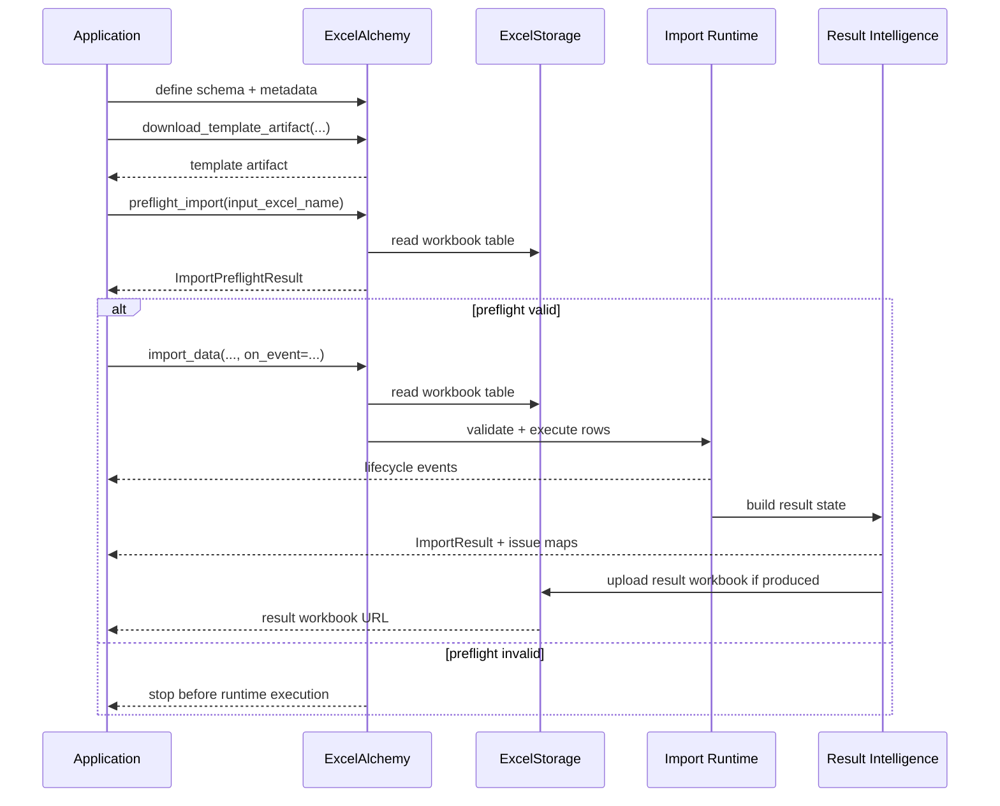

# Runtime Model

This page describes the runtime sequence of the ExcelAlchemy import platform.
It explains how the public workflow moves from authoring through delivery
without redefining the underlying component architecture.

If you want the platform capability map first, see
[`docs/platform-architecture.md`](platform-architecture.md).
If you want integration-oriented blueprints, see
[`docs/integration-blueprints.md`](integration-blueprints.md).
If you want the internal component view, see
[`docs/architecture.md`](architecture.md).

## Runtime Sequence

The recommended mental model is:

1. template authoring
2. preflight gate
3. import runtime
4. result intelligence
5. artifact and delivery

This sequence reflects current 2.x behavior.
It is not a promise of new orchestration primitives.



## Stage Boundaries

### Template Authoring

Runtime role:

- none for uploaded workbook execution
- prepares the workbook contract and user guidance ahead of time

Important constraints:

- template guidance is additive
- it does not add a separate template engine
- it does not validate uploaded data by itself

### Preflight Gate

Runtime role:

- fast structural decision point before full import execution

What it does:

- reads the workbook through configured storage
- checks sheet presence
- checks header/structure compatibility
- estimates row count

What it does not do:

- row-level validation
- callback dispatch
- result workbook generation
- remediation computation

### Import Runtime

Runtime role:

- owns the real import execution path

What it does:

- loads workbook data
- parses and validates headers
- reconstructs row payloads
- validates through the configured runtime path
- dispatches create/update/upsert behavior
- emits inline lifecycle events when `on_event=...` is supplied

What it does not do:

- create a separate background execution framework
- stream rows as a separate public runtime model

### Result Intelligence

Runtime role:

- turns execution state into stable post-import surfaces

What it does:

- classify the run outcome
- expose header issues
- expose row and cell issue maps
- support grouped summaries
- support optional remediation-oriented payload shaping

What it does not do:

- change import execution behavior
- automatically fix workbooks
- replace the default stable payloads

### Artifact and Delivery

Runtime role:

- deliver the artifacts and URLs created by earlier stages

What it does:

- return template artifacts
- upload result workbooks when applicable
- expose result workbook URLs through the public result surface

What it does not do:

- define the storage product choice
- require Minio as the architecture

## How The Runtime Model Sits On The Existing Facade

The facade remains the public orchestration boundary.
The platform runtime model is layered on top of that boundary rather than
beside it.

```mermaid
flowchart TD
    A[Application]
    A --> B[ExcelAlchemy Facade]

    B --> C[Template Methods]
    B --> D[preflight_import(...)]
    B --> E[import_data(..., on_event=...)]

    D --> F[Structural Gate Path]
    E --> G[Import Session Path]

    G --> H[ImportResult]
    G --> I[CellErrorMap / RowIssueMap]
    H --> J[Artifact and Delivery]
```

This is why the recommended documentation split is:

- platform architecture docs for capability and sequence
- internal architecture docs for collaborator ownership

## Runtime Maturity And Boundaries

The current platform is mature enough to document as a coherent model, but the
doc set should stay precise about scope:

- lifecycle events are additive synchronous callbacks
- preflight is lightweight and structural
- remediation payloads are opt-in and conservative
- artifact delivery depends on the configured storage seam
- large imports may still need worker-style application orchestration outside
  the library

## Recommended Reading

- [`docs/platform-architecture.md`](platform-architecture.md)
- [`docs/integration-blueprints.md`](integration-blueprints.md)
- [`docs/result-objects.md`](result-objects.md)
- [`docs/api-response-cookbook.md`](api-response-cookbook.md)
