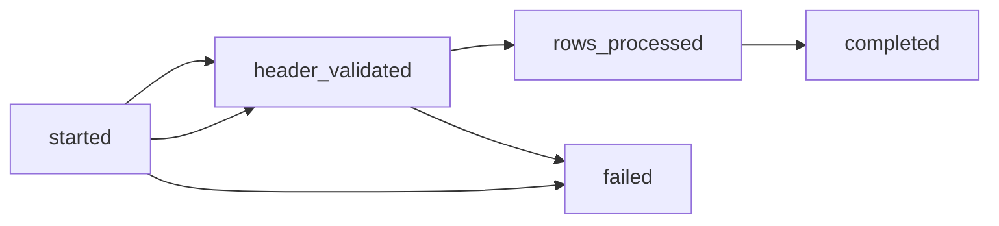
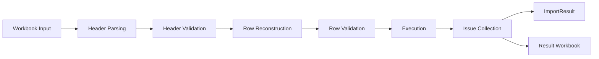
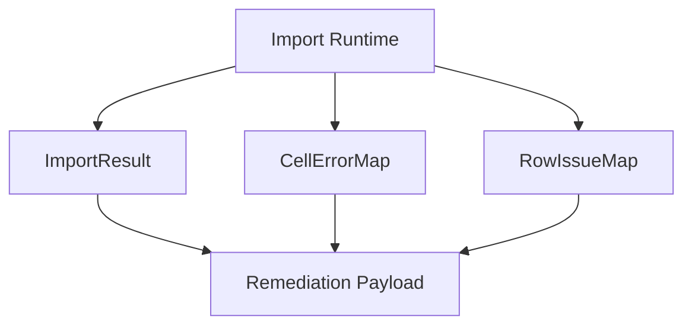

# Runtime Model

This page explains the real runtime model of ExcelAlchemy imports in the 2.x
line.
It is not a list of APIs.
It is a guide to what happens during an import run, why the stages are
separated, and how a backend engineer should reason about runtime behavior
during integration and debugging.

If you want the higher-level platform view, see
[`docs/platform-architecture.md`](platform-architecture.md).
If you want internal module ownership, see
[`docs/architecture.md`](architecture.md).
If you want integration patterns built on top of this runtime, see
[`docs/integration-blueprints.md`](integration-blueprints.md).

## Overview

ExcelAlchemy treats an import as a staged runtime rather than a single
"validate this file" function.
That staged model exists because backend systems usually need several different
runtime decisions:

- should this workbook be rejected before full execution
- when should row execution begin
- how should progress be observed during the run
- how should failures be surfaced after the run
- how should the generated workbook artifact be delivered

The runtime model in the 2.x line is intentionally simple:

- `preflight` is a lightweight structural gate
- `import` is the real synchronous execution path
- `result objects` are post-run inspection surfaces
- `remediation payload` is an additive projection on top of those results

That separation keeps the runtime easier to reason about in backend services.

## Preflight vs Import

### Why they are separate

Preflight and import answer different runtime questions.
Combining them into one overloaded call would blur behavior and make backend
handling more expensive and less predictable.

Preflight exists so an application can answer:

- does the configured sheet exist
- do the workbook headers match the schema
- does the workbook look structurally importable
- roughly how many data rows will a later import process

Import exists so an application can answer:

- can the runtime validate the rows
- can the runtime execute create/update logic
- what were the row-level and cell-level failures
- was a result workbook produced

### Preflight responsibilities

Preflight is the structural gate.

It is responsible for:

- workbook readability through the configured storage seam
- sheet existence checks
- header compatibility checks
- lightweight structure validation
- row-count estimation

It is not responsible for:

- row validation
- callback execution
- cell and row issue collection
- remediation hint construction
- result workbook generation

### Import responsibilities

Import is the full execution path.

It is responsible for:

- loading workbook data for execution
- parsing and validating headers for the real run
- reconstructing row payloads
- validating and dispatching create/update/create-or-update behavior
- collecting issues
- rendering and delivering result artifacts when applicable

It is not a replacement for application-level orchestration such as queues,
workers, or polling endpoints.

### Practical guidance

Use preflight when you want a cheap structural decision before you commit to
the real import cost.

Use import when you want the actual runtime outcome.

For many backend APIs, the recommended order is:

1. call `preflight_import(...)`
2. stop early if the workbook is structurally invalid
3. call `import_data(...)` only for workbooks that pass the structural gate

## Import Lifecycle

The import lifecycle is exposed through additive event callbacks on the same
synchronous runtime path.
These events are useful for service-layer status tracking and debugging, but
they should be interpreted as runtime signals rather than a separate execution
framework.

### Lifecycle event sequence

### `started`

Meaning:

- the import runtime has begun
- the application can now treat the run as active

This event does not mean:

- headers are valid
- any row has executed
- a final result exists yet

Typical backend use:

- mark an import job or request as running

### `header_validated`

Meaning:

- the runtime has reached a definite header decision
- the workbook is now known to be either structurally acceptable for row
  execution or blocked by header issues

This event is important because header validity is a real decision boundary.
If headers are invalid, row execution should not continue.

Typical backend use:

- log whether the run stopped at the header stage
- surface missing/unrecognized/duplicated header issues early

### `rows_processed`

Meaning:

- the runtime has advanced through row execution work
- the counters now reflect how much of the row path has been processed

This event should be read as a runtime progress projection, not as a promise of
precise or externally synchronized progress accounting.

Typical backend use:

- update status for a worker or polling UI
- emit operational logs during longer imports

### `completed`

Meaning:

- the runtime reached a normal terminal outcome
- a final `ImportResult` exists

Important detail:

- `SUCCESS`, `DATA_INVALID`, and `HEADER_INVALID` are all normal completed
  outcomes

This event does not mean:

- all rows were successful

Typical backend use:

- persist the final outcome
- return or store the result payloads
- expose result workbook URLs when available

### `failed`

Meaning:

- the runtime terminated because of an unexpected exception path rather than a
  normal import outcome

Important detail:

- this is not the same as `DATA_INVALID`
- it is also not the same as `HEADER_INVALID`

Typical backend use:

- mark the run as failed at the service layer
- log the error type and message
- distinguish unexpected failures from normal validation failures

## Data Flow

The runtime can be understood as a staged data flow from workbook input to
post-run outputs.

### 1. Workbook input

The runtime begins from a workbook reference resolved through `ExcelStorage`.
This keeps workbook access behind the configured storage seam rather than
hard-wiring a specific delivery or storage mechanism into the runtime.

### 2. Header parsing

The runtime interprets the workbook header block using the schema-derived
layout.
This stage decides how the workbook structure should be read before any row
execution occurs.

### 3. Header validation

The parsed headers are checked against the schema contract.
This is the first major execution gate:

- valid headers allow the row path to continue
- invalid headers stop the runtime before row execution

### 4. Row reconstruction

The workbook rows are reconstructed into model-shaped payloads that match the
declared schema rather than staying as a flat spreadsheet transport format.

### 5. Row validation

Those reconstructed payloads are validated through the runtime’s schema-aware
validation path.
This is where field semantics, Pydantic validation, and workbook-coordinate
error mapping begin to converge.

### 6. Execution

Rows that reach the execution stage are dispatched through the configured
create/update/create-or-update behavior.
This is the stage where application callbacks and import policy matter.

### 7. Issue collection

As the runtime validates and executes rows, it collects:

- top-level outcome data
- row-level issues
- cell-level issues

Those issue collections are preserved in workbook coordinates so the API layer
and workbook feedback can still tell the same story.

### 8. Final outputs

After execution, the runtime exposes:

- `ImportResult`
- `CellErrorMap`
- `RowIssueMap`
- result workbook artifacts and URLs when applicable

## Result Model

The result model is intentionally layered.
Different result surfaces answer different post-run questions.

### `ImportResult`

`ImportResult` is the top-level summary of one import run.

It answers:

- was the run successful
- was the run blocked by header issues
- were there data-invalid rows
- how many rows succeeded or failed
- is there a result workbook URL

Use `ImportResult` when your backend needs the main outcome classification.

### `CellErrorMap`

`CellErrorMap` is the fine-grained failure surface.

It answers:

- which workbook cell failed
- which field label the failure belongs to
- what machine-readable code and human-readable message should be exposed

Use `CellErrorMap` when your backend or frontend needs precise workbook-
coordinate visibility.

### `RowIssueMap`

`RowIssueMap` is the row-oriented failure surface.

It answers:

- which rows failed
- what grouped row-level summaries should be exposed
- how to build row tables, row summaries, or admin review lists

Use `RowIssueMap` when your consumers need grouped row reasoning rather than
cell-level precision alone.

### Remediation payload

The remediation payload is an additive projection over the existing result
surfaces.

It answers:

- does the user need remediation before retrying
- what fields or codes are good remediation entry points
- what conservative next-step guidance can be derived from the current results

Important boundary:

- it is not a replacement for `ImportResult`
- it is not a replacement for `CellErrorMap` or `RowIssueMap`
- it is not part of the execution path itself

### Relationship between result surfaces

The relationship is:

- `ImportResult`
  - top-level outcome
- `CellErrorMap`
  - precise cell-level inspection
- `RowIssueMap`
  - grouped row-level inspection
- remediation payload
  - compact retry-oriented projection built from the other result surfaces

This layering is deliberate:

- stable core results remain the primary contract
- thinner task-oriented projections can be built on top without redefining the
  core runtime model

## Runtime Guarantees

The runtime model makes a few deliberate guarantees and non-guarantees.

### Synchronous execution

The import path is synchronous-first at the library level.
When you call `import_data(...)`, the runtime executes on that path and emits
events inline.

This helps keep runtime semantics easier to understand in backend services.

### Structural preflight is separate

Preflight is guaranteed to remain a distinct structural stage rather than a
hidden mode of the full import runtime.
That separation is what makes early rejection cheap and predictable.

### Events are runtime projections

Lifecycle events are best understood as a best-effort projection of runtime
state for the current synchronous run.

They are useful for:

- service-layer status updates
- logs
- worker progress displays

They are not guaranteed to be:

- a complete audit log
- a transactional event stream
- a precise external progress protocol

### Progress is practical, not exact

Row progress counters are useful operationally, but they should not be treated
as a guarantee of exact end-user-visible progress semantics in every hosting
environment.

### Result surfaces are post-run inspection layers

`ImportResult`, `CellErrorMap`, and `RowIssueMap` are guaranteed to be
post-runtime inspection surfaces, not control surfaces for changing execution.

### Storage is a seam, not a product decision

Artifact delivery uses `ExcelStorage`, but the runtime does not require a
particular storage product or vendor architecture.

## Why The Runtime Is Designed This Way

The runtime model is designed to keep three things true at the same time:

1. backend engineers can stop bad workbooks early
2. the real import path remains explicit and observable
3. post-run failures can be consumed both by humans and by APIs

That is why the 2.x line keeps these boundaries:

- preflight is separate from execution
- lifecycle events are additive to the same runtime call
- result objects remain stable post-run outputs
- remediation remains an opt-in projection

This keeps the runtime understandable for integration work without turning the
library into a job orchestration framework.

## Recommended Reading

- [`docs/platform-architecture.md`](platform-architecture.md)
- [`docs/integration-blueprints.md`](integration-blueprints.md)
- [`docs/result-objects.md`](result-objects.md)
- [`docs/api-response-cookbook.md`](api-response-cookbook.md)
- [`docs/architecture.md`](architecture.md)
